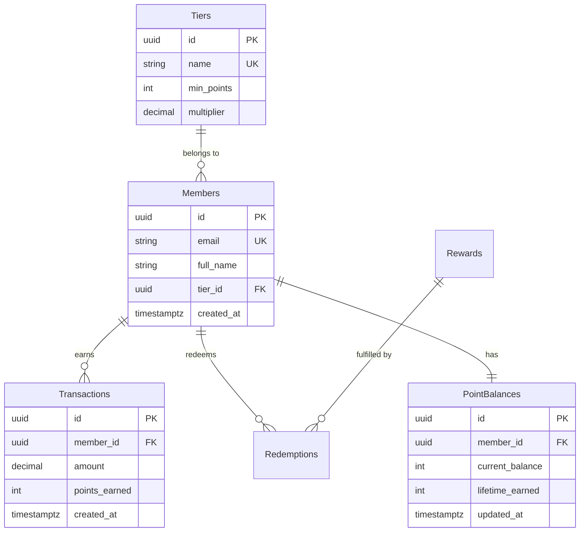

# Database Design

> **Philosophy**: Design databases that are correct first, performant second, and maintainable always.
>
> **Filosofi**: Rancang database yang benar terlebih dahulu, performan kedua, dan selalu mudah dipelihara.

---

## When to Use This Skill

Trigger this skill in the following situations:
> Gunakan skill ini dalam situasi berikut:

- **New Project** — Designing a database schema for a new application from scratch
- **Schema Refactoring** — Redesigning existing schemas for performance or scalability
- **Relationship Design** — Implementing 1:1, 1:N, N:M relationships between tables
- **Migrations** — Safely applying schema changes to production databases
- **Performance Issues** — Optimizing slow queries via indexes and schema restructuring
- **Multi-Tenancy** — Designing shared or isolated tenant data architectures
- **Security Hardening** — Implementing RLS, column encryption, role-based DB access
- **Audit & Compliance** — Adding change tracking, history tables, GDPR/PII handling
- **Data Seeding** — Generating realistic test/seed data for development

---

## Input Format

### Required Information (Informasi Wajib)

| Field | Description | Example |
|---|---|---|
| **Database Type** | PostgreSQL, MySQL, MongoDB, SQLite | PostgreSQL |
| **Domain Description** | What data will be stored | E-commerce, Loyalty System, SaaS |
| **Core Entities** | Main data objects | User, Product, Order, Points |

### Optional Information (Informasi Opsional)

| Field | Description | Default |
|---|---|---|
| **Expected Data Volume** | Small (<10K), Medium (10K-1M), Large (>1M rows) | Medium |
| **Read/Write Ratio** | Read-heavy, Write-heavy, Balanced | Balanced |
| **Transaction Requirements** | ACID compliance needed | true |
| **Multi-Tenancy** | Tenant isolation strategy needed | false |
| **Compliance** | GDPR, HIPAA, PCI-DSS requirements | none |
| **Deployment Target** | Self-hosted, Supabase, PlanetScale, Neon, RDS | Self-hosted |
| **Sharding/Partitioning** | Large-scale data distribution needed | false |

### Input Example

```
Design a loyalty system database for a retail platform:
- DB: PostgreSQL
- Entities: Member, Tier, Transaction, PointBalance, Reward, Redemption
- Relationships:
  - Member belongs to a Tier
  - Member earns Points via Transactions
  - Member redeems Points for Rewards
- Expected data: 500K members, 10M transactions/year
- Read-heavy (balance checks frequent)
- GDPR compliance required
- Deploy on Supabase
```

---

## Instructions

Follow these steps in order. Each step builds on the previous.
> Ikuti langkah-langkah berikut secara berurutan. Setiap langkah dibangun dari langkah sebelumnya.

### Step 0: Requirements Gathering (Pengumpulan Kebutuhan)

**Before designing anything**, ask clarifying questions.
> **Sebelum merancang apapun**, ajukan pertanyaan klarifikasi.

**Questions to ask the user**:

1. **Domain & Scale**: What is the application domain? How many users/records do you expect in Year 1 and Year 3?
2. **Read/Write Pattern**: Is the workload read-heavy (dashboards, reports) or write-heavy (logging, events)?
3. **Multi-Tenancy**: Do multiple organizations/tenants share the database?
4. **Compliance**: Are there regulatory requirements (GDPR, HIPAA, PCI-DSS)?
5. **Existing Stack**: What framework/language is the backend? (Node.js, Python, Go, etc.)
6. **Deployment**: Where will the database be hosted? (Self-hosted, Supabase, PlanetScale, Neon, AWS RDS)
7. **Caching**: Is there a caching layer? (Redis, Memcached)
8. **Search**: Do you need full-text search? (PostgreSQL FTS, Elasticsearch)
9. **Audit Trail**: Do you need to track who changed what and when?
10. **Soft Delete**: Should records be logically deleted (kept but hidden) or physically removed?

**If the user provides incomplete information**, use these defaults:
- Database: PostgreSQL
- Scale: Medium (10K-1M rows)
- Read/Write: Balanced
- Multi-Tenancy: false
- Compliance: none
- Soft Delete: true (recommended)
- Audit: true (recommended)

---

### Step 1: Entity & Attribute Definition (Definisi Entitas & Atribut)

Identify core data objects and their attributes.
> Identifikasi objek data inti dan atributnya.

**Tasks**:
- Extract nouns from business requirements → Entities
- List attributes (columns) for each entity
- Determine data types (VARCHAR, INTEGER, TIMESTAMP, JSONB, etc.)
- Choose Primary Key strategy (UUID vs BIGSERIAL)
- Add standard columns: `created_at`, `updated_at`, `deleted_at` (soft delete)

**Primary Key Decision Matrix**:

| Criteria | UUID (v4/v7) | BIGSERIAL |
|---|---|---|
| Distributed systems | ✅ Best choice | ❌ Conflicts |
| URL-safe IDs | ✅ Non-guessable | ❌ Sequential = guessable |
| Insert performance | ⚠️ Random (v4) / ✅ Ordered (v7) | ✅ Sequential |
| Storage size | 16 bytes | 8 bytes |
| Human readability | ❌ Long | ✅ Short |

**Recommendation**: Use `UUID v7` (time-ordered) for new projects. Use `BIGSERIAL` for high-insert-rate tables or when simplicity matters.
> **Rekomendasi**: Gunakan `UUID v7` untuk proyek baru. Gunakan `BIGSERIAL` untuk tabel dengan insert rate tinggi.

**Example**:
```sql
-- Standard table template
-- Template tabel standar
CREATE TABLE members (
    id UUID PRIMARY KEY DEFAULT gen_random_uuid(),
    email VARCHAR(255) UNIQUE NOT NULL,
    full_name VARCHAR(100) NOT NULL,
    phone VARCHAR(20),
    tier_id UUID REFERENCES tiers(id),
    is_active BOOLEAN DEFAULT true,
    created_at TIMESTAMPTZ DEFAULT NOW(),
    updated_at TIMESTAMPTZ DEFAULT NOW(),
    deleted_at TIMESTAMPTZ  -- NULL = active, NOT NULL = soft deleted
);
```

---

### Step 2: Relationship Design & Normalization (Desain Relasi & Normalisasi)

Define relationships between tables and apply normalization.
> Definisikan hubungan antar tabel dan terapkan normalisasi.

**Relationship Types**:
- **1:1** → Foreign Key + UNIQUE constraint (e.g., User ↔ Profile)
- **1:N** → Foreign Key on the "many" side (e.g., Tier → Members)
- **N:M** → Junction table (e.g., Order ↔ Products via OrderItems)
- **Self-referencing** → FK to same table (e.g., comments → parent_comment)
- **Polymorphic** → `entity_type` + `entity_id` pattern (use sparingly)

**Normalization Decision Guide**:
> Panduan keputusan normalisasi:

| System Type | Normalization Level | Reason |
|---|---|---|
| OLTP (transactional) | 3NF (full) | Data integrity, no anomalies |
| OLAP (analytics) | 1NF-2NF (denormalized) | Query performance, fewer JOINs |
| Read-heavy | Selective denormalization | Cache frequently joined data |
| Write-heavy | Full normalization | Eliminate update anomalies |

**ERD Template (Must ALWAYS use Mermaid)**:


---

### Step 3: Index Strategy (Strategi Indeks)

Design indexes for query performance.
> Rancang indeks untuk performa query.

**Index Decision Rules**:
1. ✅ Primary Keys → automatic index
2. ✅ Foreign Keys → **always** add explicit index
3. ✅ Columns in WHERE clauses → index
4. ✅ Columns in ORDER BY → index (match sort direction)
5. ✅ Columns in JOIN conditions → index
6. ⚠️ Low-cardinality columns (boolean, status) → partial index instead
7. ❌ Don't over-index → each index slows INSERT/UPDATE

**Index Types (PostgreSQL)**:

| Type | Use Case | Example |
|---|---|---|
| B-tree (default) | Equality, range, sorting | `WHERE price > 100` |
| Hash | Equality only | `WHERE id = ?` |
| GIN | JSONB, arrays, full-text | `WHERE tags @> '["sale"]'` |
| GiST | Geometry, range types | PostGIS, `tsrange` |
| BRIN | Large sequential data | Time-series, logs |

**Advanced Index Examples**:
```sql
-- Standard FK indexes (WAJIB / REQUIRED)
CREATE INDEX idx_transactions_member_id ON transactions(member_id);
CREATE INDEX idx_members_tier_id ON members(tier_id);

-- Composite index (frequently queried together)
-- Indeks komposit (sering di-query bersamaan)
CREATE INDEX idx_transactions_member_date
    ON transactions(member_id, created_at DESC);

-- Partial index (only index active records — saves space)
-- Indeks parsial (hanya indeks record aktif — hemat ruang)
CREATE INDEX idx_members_active_email
    ON members(email) WHERE deleted_at IS NULL;

-- Covering index (index-only scan — no table lookup needed)
CREATE INDEX idx_transactions_covering
    ON transactions(member_id, created_at DESC)
    INCLUDE (points_earned, amount);

-- GIN index for JSONB search
CREATE INDEX idx_members_metadata ON members USING GIN(metadata jsonb_path_ops);

-- Full-text search index
CREATE INDEX idx_rewards_name_fts
    ON rewards USING GIN(to_tsvector('english', name || ' ' || description));

-- Expression index
CREATE INDEX idx_members_email_lower ON members(LOWER(email));
```

**EXPLAIN ANALYZE — How to Read Query Plans**:
> Cara membaca rencana query:

```sql
EXPLAIN (ANALYZE, BUFFERS, FORMAT TEXT)
SELECT m.full_name, pb.current_balance
FROM members m
JOIN point_balances pb ON pb.member_id = m.id
WHERE m.tier_id = 'uuid-here' AND m.deleted_at IS NULL;
```

Key things to look for:
- `Seq Scan` → Missing index (bad for large tables)
- `Index Scan` / `Index Only Scan` → Good, using index
- `Nested Loop` → Fine for small result sets
- `Hash Join` → Good for larger joins
- `actual time` → Real execution time in ms
- `rows` vs `rows=` → Estimated vs actual (big diff = stale statistics, run `ANALYZE`)

---

### Step 4: Constraints, Triggers & Type Safety (Constraint, Trigger & Type Safety)

Add constraints for data integrity and type safety.
> Tambahkan constraint untuk integritas data dan type safety.

**Constraint Types**:
```sql
-- NOT NULL: Required columns
-- UNIQUE: No duplicates
-- CHECK: Value range validation
-- FOREIGN KEY: Referential integrity
-- EXCLUDE: Prevent overlapping ranges (PostgreSQL)
```

**PostgreSQL ENUM for Status Fields**:
> Gunakan ENUM untuk field status agar type-safe:

```sql
-- Create custom types (buat tipe kustom)
CREATE TYPE member_status AS ENUM ('active', 'suspended', 'banned', 'deleted');
CREATE TYPE transaction_type AS ENUM ('purchase', 'refund', 'bonus', 'adjustment', 'redemption');
CREATE TYPE tier_level AS ENUM ('bronze', 'silver', 'gold', 'platinum', 'diamond');

-- Use in tables
CREATE TABLE members (
    id UUID PRIMARY KEY DEFAULT gen_random_uuid(),
    email VARCHAR(255) UNIQUE NOT NULL,
    status member_status DEFAULT 'active' NOT NULL,
    -- CHECK constraint for additional validation
    phone VARCHAR(20) CHECK (phone ~ '^\+?[0-9\-\s]{7,20}$'),
    created_at TIMESTAMPTZ DEFAULT NOW()
);

CREATE TABLE transactions (
    id UUID PRIMARY KEY DEFAULT gen_random_uuid(),
    member_id UUID NOT NULL REFERENCES members(id) ON DELETE RESTRICT,
    type transaction_type NOT NULL,
    amount DECIMAL(12, 2) NOT NULL CHECK (amount != 0),
    points_earned INTEGER NOT NULL DEFAULT 0,
    -- Positive for earn, negative for spend
    CHECK (
        (type IN ('purchase', 'bonus') AND points_earned >= 0) OR
        (type IN ('refund', 'redemption') AND points_earned <= 0) OR
        (type = 'adjustment')
    ),
    created_at TIMESTAMPTZ DEFAULT NOW()
);
```

**Auto-update Trigger**:
```sql
-- Generic updated_at trigger (reusable for all tables)
-- Trigger updated_at generik (dapat dipakai ulang untuk semua tabel)
CREATE OR REPLACE FUNCTION trigger_set_updated_at()
RETURNS TRIGGER AS $$
BEGIN
    NEW.updated_at = NOW();
    RETURN NEW;
END;
$$ LANGUAGE plpgsql;

-- Apply to any table (terapkan ke tabel manapun)
CREATE TRIGGER set_members_updated_at
    BEFORE UPDATE ON members
    FOR EACH ROW EXECUTE FUNCTION trigger_set_updated_at();

CREATE TRIGGER set_point_balances_updated_at
    BEFORE UPDATE ON point_balances
    FOR EACH ROW EXECUTE FUNCTION trigger_set_updated_at();
```

**Point Balance Integrity Trigger**:
```sql
-- Automatically update point balance on new transaction
-- Otomatis update saldo poin saat transaksi baru
CREATE OR REPLACE FUNCTION update_point_balance()
RETURNS TRIGGER AS $$
BEGIN
    INSERT INTO point_balances (member_id, current_balance, lifetime_earned)
    VALUES (NEW.member_id, GREATEST(0, NEW.points_earned), GREATEST(0, NEW.points_earned))
    ON CONFLICT (member_id) DO UPDATE SET
        current_balance = point_balances.current_balance + NEW.points_earned,
        lifetime_earned = CASE
            WHEN NEW.points_earned > 0
            THEN point_balances.lifetime_earned + NEW.points_earned
            ELSE point_balances.lifetime_earned
        END,
        updated_at = NOW();

    -- Prevent negative balance (cegah saldo negatif)
    IF (SELECT current_balance FROM point_balances WHERE member_id = NEW.member_id) < 0 THEN
        RAISE EXCEPTION 'Insufficient point balance for member %', NEW.member_id;
    END IF;

    RETURN NEW;
END;
$$ LANGUAGE plpgsql;

CREATE TRIGGER trg_update_points
    AFTER INSERT ON transactions
    FOR EACH ROW EXECUTE FUNCTION update_point_balance();
```

---

### Step 5: Security Hardening (Penguatan Keamanan)

Implement database-level security measures.
> Implementasikan langkah-langkah keamanan di level database.

**Row-Level Security (RLS)**:
```sql
-- Enable RLS (aktifkan RLS)
ALTER TABLE members ENABLE ROW LEVEL SECURITY;

-- Policy: Users can only see their own data
-- Kebijakan: User hanya bisa melihat data miliknya
CREATE POLICY members_self_access ON members
    FOR SELECT
    USING (id = current_setting('app.current_user_id')::UUID);

-- Policy: Admins can see all
CREATE POLICY members_admin_access ON members
    FOR ALL
    USING (current_setting('app.current_role') = 'admin');
```

**Role-Based Database Access**:
```sql
-- Create roles (buat role)
CREATE ROLE app_readonly;
CREATE ROLE app_readwrite;
CREATE ROLE app_admin;

-- Read-only: SELECT only
GRANT USAGE ON SCHEMA public TO app_readonly;
GRANT SELECT ON ALL TABLES IN SCHEMA public TO app_readonly;

-- Read-write: SELECT, INSERT, UPDATE (no DELETE, no DDL)
GRANT USAGE ON SCHEMA public TO app_readwrite;
GRANT SELECT, INSERT, UPDATE ON ALL TABLES IN SCHEMA public TO app_readwrite;
GRANT USAGE ON ALL SEQUENCES IN SCHEMA public TO app_readwrite;

-- Admin: Full access
GRANT ALL PRIVILEGES ON ALL TABLES IN SCHEMA public TO app_admin;

-- Application user (least privilege)
CREATE USER app_user WITH PASSWORD 'strong_password_here';
GRANT app_readwrite TO app_user;
```

**PII & Sensitive Data Handling**:
```sql
-- Separate PII into dedicated table with stricter access
-- Pisahkan PII ke tabel khusus dengan akses lebih ketat
CREATE TABLE member_pii (
    member_id UUID PRIMARY KEY REFERENCES members(id) ON DELETE CASCADE,
    full_name_encrypted BYTEA NOT NULL,  -- pgcrypto encrypted
    phone_encrypted BYTEA,
    date_of_birth DATE,
    address_encrypted BYTEA,
    created_at TIMESTAMPTZ DEFAULT NOW()
);

-- Encrypt using pgcrypto
CREATE EXTENSION IF NOT EXISTS pgcrypto;

-- Insert with encryption
INSERT INTO member_pii (member_id, full_name_encrypted)
VALUES (
    'member-uuid',
    pgp_sym_encrypt('John Doe', current_setting('app.encryption_key'))
);

-- Read with decryption
SELECT pgp_sym_decrypt(full_name_encrypted, current_setting('app.encryption_key')) AS full_name
FROM member_pii WHERE member_id = 'member-uuid';
```

---

### Step 6: Audit & History Tracking (Audit & Pelacakan Riwayat)

Track all changes for compliance and debugging.
> Lacak semua perubahan untuk kepatuhan dan debugging.

**Generic Audit Log Table**:
```sql
CREATE TABLE audit_log (
    id BIGSERIAL PRIMARY KEY,
    table_name VARCHAR(100) NOT NULL,
    record_id UUID NOT NULL,
    action VARCHAR(10) NOT NULL CHECK (action IN ('INSERT', 'UPDATE', 'DELETE')),
    old_data JSONB,
    new_data JSONB,
    changed_fields TEXT[],
    performed_by UUID,  -- user who made the change
    performed_at TIMESTAMPTZ DEFAULT NOW(),
    ip_address INET,
    user_agent TEXT
);

CREATE INDEX idx_audit_log_table_record ON audit_log(table_name, record_id);
CREATE INDEX idx_audit_log_performed_at ON audit_log(performed_at);
CREATE INDEX idx_audit_log_performed_by ON audit_log(performed_by);

-- Generic audit trigger function
-- Fungsi trigger audit generik
CREATE OR REPLACE FUNCTION audit_trigger_func()
RETURNS TRIGGER AS $$
DECLARE
    changed TEXT[];
    col TEXT;
BEGIN
    IF TG_OP = 'UPDATE' THEN
        -- Detect which columns changed
        FOR col IN SELECT column_name FROM information_schema.columns
            WHERE table_name = TG_TABLE_NAME AND table_schema = TG_TABLE_SCHEMA
        LOOP
            IF to_jsonb(OLD) -> col IS DISTINCT FROM to_jsonb(NEW) -> col THEN
                changed := array_append(changed, col);
            END IF;
        END LOOP;
    END IF;

    INSERT INTO audit_log (table_name, record_id, action, old_data, new_data, changed_fields, performed_by)
    VALUES (
        TG_TABLE_NAME,
        CASE WHEN TG_OP = 'DELETE' THEN (OLD).id ELSE (NEW).id END,
        TG_OP,
        CASE WHEN TG_OP IN ('UPDATE', 'DELETE') THEN to_jsonb(OLD) END,
        CASE WHEN TG_OP IN ('INSERT', 'UPDATE') THEN to_jsonb(NEW) END,
        changed,
        NULLIF(current_setting('app.current_user_id', true), '')::UUID
    );

    RETURN COALESCE(NEW, OLD);
END;
$$ LANGUAGE plpgsql;

-- Apply to tables (terapkan ke tabel)
CREATE TRIGGER audit_members
    AFTER INSERT OR UPDATE OR DELETE ON members
    FOR EACH ROW EXECUTE FUNCTION audit_trigger_func();

CREATE TRIGGER audit_transactions
    AFTER INSERT OR UPDATE OR DELETE ON transactions
    FOR EACH ROW EXECUTE FUNCTION audit_trigger_func();
```

**History Table (SCD Type 2)** — for tracking tier changes:
```sql
CREATE TABLE member_tier_history (
    id BIGSERIAL PRIMARY KEY,
    member_id UUID NOT NULL REFERENCES members(id),
    tier_id UUID NOT NULL REFERENCES tiers(id),
    valid_from TIMESTAMPTZ NOT NULL DEFAULT NOW(),
    valid_to TIMESTAMPTZ,  -- NULL = current
    changed_reason VARCHAR(50),  -- 'promotion', 'demotion', 'manual'
    CONSTRAINT no_overlap EXCLUDE USING gist (
        member_id WITH =,
        tstzrange(valid_from, COALESCE(valid_to, 'infinity')) WITH &&
    )
);

CREATE INDEX idx_tier_history_member ON member_tier_history(member_id, valid_from DESC);
```

---

### Step 7: Migration Scripts (Skrip Migrasi)

Write safe, rollback-capable migration scripts.
> Tulis skrip migrasi yang aman dan bisa di-rollback.

**Migration Rules**:
1. ✅ Always wrap in transactions
2. ✅ Always provide UP and DOWN migrations
3. ✅ Use `IF EXISTS` / `IF NOT EXISTS` for idempotency
4. ✅ Add columns as nullable first, then backfill, then set NOT NULL
5. ❌ Never rename columns directly in production (add new → backfill → drop old)
6. ❌ Never drop columns without a deprecation period

**Zero-Downtime Migration Pattern**:
```sql
-- migrations/001_initial_schema.up.sql
BEGIN;

CREATE EXTENSION IF NOT EXISTS "pgcrypto";

-- Tiers (create first — referenced by members)
CREATE TABLE IF NOT EXISTS tiers (
    id UUID PRIMARY KEY DEFAULT gen_random_uuid(),
    name VARCHAR(50) UNIQUE NOT NULL,
    level tier_level NOT NULL,
    min_points INTEGER NOT NULL DEFAULT 0,
    multiplier DECIMAL(3, 2) NOT NULL DEFAULT 1.00,
    benefits JSONB DEFAULT '{}',
    created_at TIMESTAMPTZ DEFAULT NOW()
);

-- Members
CREATE TABLE IF NOT EXISTS members (
    id UUID PRIMARY KEY DEFAULT gen_random_uuid(),
    email VARCHAR(255) UNIQUE NOT NULL,
    full_name VARCHAR(100) NOT NULL,
    phone VARCHAR(20),
    tier_id UUID REFERENCES tiers(id) ON DELETE SET NULL,
    status member_status DEFAULT 'active' NOT NULL,
    metadata JSONB DEFAULT '{}',
    created_at TIMESTAMPTZ DEFAULT NOW(),
    updated_at TIMESTAMPTZ DEFAULT NOW(),
    deleted_at TIMESTAMPTZ
);

CREATE INDEX IF NOT EXISTS idx_members_email ON members(email) WHERE deleted_at IS NULL;
CREATE INDEX IF NOT EXISTS idx_members_tier ON members(tier_id);
CREATE INDEX IF NOT EXISTS idx_members_status ON members(status) WHERE deleted_at IS NULL;

COMMIT;

-- migrations/001_initial_schema.down.sql
BEGIN;
DROP TABLE IF EXISTS members CASCADE;
DROP TABLE IF EXISTS tiers CASCADE;
COMMIT;
```

**Adding a Column (Zero-Downtime)**:
```sql
-- migrations/005_add_referral_code.up.sql
-- Step 1: Add nullable column (no lock)
ALTER TABLE members ADD COLUMN IF NOT EXISTS referral_code VARCHAR(20);

-- Step 2: Backfill existing rows (in batches to avoid long locks)
-- Isi data existing (dalam batch untuk menghindari lock lama)
DO $$
DECLARE
    batch_size INT := 1000;
    affected INT := 1;
BEGIN
    WHILE affected > 0 LOOP
        UPDATE members
        SET referral_code = UPPER(SUBSTRING(id::TEXT, 1, 8))
        WHERE referral_code IS NULL
        AND id IN (SELECT id FROM members WHERE referral_code IS NULL LIMIT batch_size);
        GET DIAGNOSTICS affected = ROW_COUNT;
        PERFORM pg_sleep(0.1);  -- Brief pause between batches
    END LOOP;
END $$;

-- Step 3: Add constraint (after backfill complete)
ALTER TABLE members ALTER COLUMN referral_code SET NOT NULL;
CREATE UNIQUE INDEX IF NOT EXISTS idx_members_referral ON members(referral_code);

-- migrations/005_add_referral_code.down.sql
ALTER TABLE members DROP COLUMN IF EXISTS referral_code;
```

---

### Step 8: Sample Data & Documentation (Data Sampel & Dokumentasi)

Generate realistic sample data and document how tables are used.
> Buat data sampel realistis dan dokumentasikan penggunaan tabel.

**Tasks**:
1. **Sample Data (`sample_data.sql`)**: Write complete `INSERT` statements with realistic raw data.
2. **Data Usage (`sample_data.md`)**: Document the usage of the tables with the raw data and descriptions.
3. **ERD (`ERD.md`)**: **ALWAYS use Mermaid syntax** for the Entity-Relationship Diagram.
4. **Schema (`SCHEMA.md`)**: Document tables, columns, constraints, and relationships.

**Sample Data Documentation Template (`sample_data.md`)**:
```markdown
# Sample Data Usage

### Table: members
Stores the core user information and points to their active tier.

**Raw Data**:
```sql
INSERT INTO members (id, email, full_name, tier_id) VALUES
('b1c2...', 'member@example.com', 'Alice', 'tier-uuid');
```
**Description**:
- Alice is an active member belonging to the Bronze tier. This record links to `tiers` via `tier_id`.
```

---

## Multi-Tenancy Patterns (Pola Multi-Tenancy)

Choose the right isolation strategy based on your requirements.
> Pilih strategi isolasi yang tepat berdasarkan kebutuhan Anda.

| Pattern | Isolation | Complexity | Cost | Best For |
|---|---|---|---|---|
| **Shared DB + `tenant_id`** | Low | Low | Low | Most SaaS apps |
| **Schema-per-tenant** | Medium | Medium | Medium | Regulated industries |
| **Database-per-tenant** | High | High | High | Enterprise, compliance-critical |

### Pattern 1: Shared DB with `tenant_id` (Recommended Default)

```sql
-- Add tenant_id to every table (tambahkan tenant_id ke setiap tabel)
CREATE TABLE members (
    id UUID PRIMARY KEY DEFAULT gen_random_uuid(),
    tenant_id UUID NOT NULL REFERENCES tenants(id),
    email VARCHAR(255) NOT NULL,
    -- email unique PER tenant, not globally
    UNIQUE (tenant_id, email),
    created_at TIMESTAMPTZ DEFAULT NOW()
);

-- RLS policy for automatic tenant isolation
ALTER TABLE members ENABLE ROW LEVEL SECURITY;

CREATE POLICY tenant_isolation ON members
    FOR ALL
    USING (tenant_id = current_setting('app.current_tenant_id')::UUID)
    WITH CHECK (tenant_id = current_setting('app.current_tenant_id')::UUID);

-- Always index tenant_id (selalu indeks tenant_id)
CREATE INDEX idx_members_tenant ON members(tenant_id);
```

### Pattern 2: Schema-per-Tenant

```sql
-- Create tenant schema (buat schema per tenant)
CREATE SCHEMA tenant_acme;

-- Create tables in tenant schema
CREATE TABLE tenant_acme.members (
    id UUID PRIMARY KEY DEFAULT gen_random_uuid(),
    email VARCHAR(255) UNIQUE NOT NULL,
    created_at TIMESTAMPTZ DEFAULT NOW()
);

-- Switch schema at connection time
SET search_path TO tenant_acme, public;
```

---

## Output Format (Format Output)

### Project Structure

```
project/
├── database/                    
│   ├── migrations/
│   │   ├── 001_create_users.up.sql
│   │   ├── 001_create_users.down.sql
│   │   ├── 002_create_products.up.sql
│   │   └── 002_create_products.down.sql
│   ├── seeds/
│   │   ├── sample_data.md             # Usage of tables with raw data and description
│   │   └── sample_data.sql            # Raw data SQL inserts
│   ├── schema.sql
│   ├── ERD.md                     # Mermaid ERD (ALWAYS use Mermaid)
│   └── SCHEMA.md                  # Table documentation
└── README.md
```

### Table Documentation Template

```markdown
### table_name

| Column | Type | Nullable | Default | Description |
|--------|------|----------|---------|-------------|
| id | UUID | NO | gen_random_uuid() | Primary key |
| name | VARCHAR(100) | NO | — | Display name |
| created_at | TIMESTAMPTZ | NO | NOW() | Record creation time |
| deleted_at | TIMESTAMPTZ | YES | NULL | Soft delete timestamp |

**Indexes**: idx_table_column1, idx_table_column2
**Triggers**: set_updated_at
**RLS**: Enabled (tenant_isolation policy)
**Estimated rows**: 100,000
```

---

## Constraints & Rules (Aturan & Batasan)

### MUST (Wajib)

1. **Primary Key on every table** — No exceptions
2. **Foreign Key explicit** — Always specify ON DELETE behavior (CASCADE / SET NULL / RESTRICT)
3. **Index all Foreign Keys** — PostgreSQL does NOT auto-index FKs
4. **NOT NULL on required fields** — Don't allow NULL where data is required
5. **`created_at` on every table** — Always track when records were created
6. **`updated_at` on mutable tables** — With auto-update trigger
7. **Soft delete by default** — Use `deleted_at TIMESTAMPTZ` for important entities
8. **Use TIMESTAMPTZ** — Always timezone-aware, never bare `TIMESTAMP`
9. **Snake_case naming** — Tables plural (`members`), columns singular (`email`)
10. **Transactions for migrations** — Always wrap DDL in BEGIN/COMMIT

### MUST NOT (Dilarang)

1. **❌ Store passwords in plaintext** — Use bcrypt/scrypt hashing at application level
2. **❌ Store credit card numbers** — Use a payment processor (Stripe, etc.)
3. **❌ Over-use EAV pattern** — Entity-Attribute-Value makes queries impossibly complex
4. **❌ Use SELECT \*** — Always specify columns
5. **❌ Skip Foreign Keys for "performance"** — Integrity > micro-optimization
6. **❌ Store monetary values as FLOAT** — Use `DECIMAL(12, 2)` or `INTEGER` (cents)
7. **❌ Use bare TIMESTAMP** — Always use `TIMESTAMPTZ` for timezone safety
8. **❌ Rename columns directly in production** — Add new, backfill, drop old
9. **❌ Store files/images as BLOBs** — Store URLs, use object storage (S3, GCS)

---

## Schema Validation Checklist (Daftar Periksa Validasi Skema)

Before finalizing any schema, verify every item:
> Sebelum menyelesaikan skema apapun, verifikasi setiap item:

```
[ ] Every table has a PRIMARY KEY
[ ] Every FK column has an explicit INDEX
[ ] Every FK has ON DELETE behavior specified
[ ] Every required column is NOT NULL
[ ] Every table has created_at TIMESTAMPTZ
[ ] Mutable tables have updated_at with trigger
[ ] Important entities have deleted_at (soft delete)
[ ] All TIMESTAMP columns use TIMESTAMPTZ (with timezone)
[ ] Monetary values use DECIMAL, not FLOAT
[ ] Status fields use ENUM or CHECK constraints
[ ] Table names are plural snake_case
[ ] Column names are singular snake_case
[ ] No reserved words used as identifiers
[ ] Sensitive data is encrypted or in separate PII table
[ ] Indexes exist for common WHERE/JOIN/ORDER BY columns
[ ] Composite indexes have correct column order (high selectivity first)
[ ] Migration has both UP and DOWN scripts
[ ] Migration is wrapped in transaction
[ ] Migration generates UP and DOWN scripts inside `database/migrations/`
[ ] sample_data.sql and sample_data.md are provided with raw data and usage descriptions
[ ] ERD diagram ALWAYS uses Mermaid syntax and is saved in `database/ERD.md`
```

---

## Examples

### Example 1: Loyalty System (Sistem Loyalitas)

**Scenario**: Retail loyalty program with tier-based point earning and reward redemption.
> **Skenario**: Program loyalitas retail dengan earning poin berbasis tier dan penukaran reward.

**Requirements**:
- Members earn points from purchases
- Points multiplier based on tier level
- Members can redeem points for rewards
- Tier auto-promotion based on lifetime points
- Full audit trail required

**Full Schema**:
```sql
-- Custom Types
CREATE TYPE member_status AS ENUM ('active', 'suspended', 'banned');
CREATE TYPE transaction_type AS ENUM ('purchase', 'refund', 'bonus', 'adjustment', 'redemption');
CREATE TYPE tier_level AS ENUM ('bronze', 'silver', 'gold', 'platinum', 'diamond');
CREATE TYPE redemption_status AS ENUM ('pending', 'approved', 'fulfilled', 'cancelled');

-- Tiers
CREATE TABLE tiers (
    id UUID PRIMARY KEY DEFAULT gen_random_uuid(),
    name VARCHAR(50) UNIQUE NOT NULL,
    level tier_level UNIQUE NOT NULL,
    min_points INTEGER NOT NULL DEFAULT 0,
    points_multiplier DECIMAL(3, 2) NOT NULL DEFAULT 1.00,
    benefits JSONB DEFAULT '[]',
    is_active BOOLEAN DEFAULT true,
    created_at TIMESTAMPTZ DEFAULT NOW()
);

-- Members
CREATE TABLE members (
    id UUID PRIMARY KEY DEFAULT gen_random_uuid(),
    member_code VARCHAR(20) UNIQUE NOT NULL,
    email VARCHAR(255) UNIQUE NOT NULL,
    full_name VARCHAR(100) NOT NULL,
    phone VARCHAR(20),
    tier_id UUID NOT NULL REFERENCES tiers(id),
    status member_status DEFAULT 'active' NOT NULL,
    joined_at DATE NOT NULL DEFAULT CURRENT_DATE,
    metadata JSONB DEFAULT '{}',
    created_at TIMESTAMPTZ DEFAULT NOW(),
    updated_at TIMESTAMPTZ DEFAULT NOW(),
    deleted_at TIMESTAMPTZ
);

CREATE INDEX idx_members_tier ON members(tier_id);
CREATE INDEX idx_members_status ON members(status) WHERE deleted_at IS NULL;
CREATE INDEX idx_members_email ON members(LOWER(email)) WHERE deleted_at IS NULL;
CREATE INDEX idx_members_code ON members(member_code);

-- Point Balances (1:1 with Members)
CREATE TABLE point_balances (
    member_id UUID PRIMARY KEY REFERENCES members(id) ON DELETE CASCADE,
    current_balance INTEGER NOT NULL DEFAULT 0 CHECK (current_balance >= 0),
    lifetime_earned INTEGER NOT NULL DEFAULT 0 CHECK (lifetime_earned >= 0),
    lifetime_redeemed INTEGER NOT NULL DEFAULT 0 CHECK (lifetime_redeemed >= 0),
    updated_at TIMESTAMPTZ DEFAULT NOW()
);

-- Transactions (point earning events)
CREATE TABLE transactions (
    id UUID PRIMARY KEY DEFAULT gen_random_uuid(),
    member_id UUID NOT NULL REFERENCES members(id) ON DELETE RESTRICT,
    type transaction_type NOT NULL,
    reference_id VARCHAR(100),  -- external order/invoice ID
    amount DECIMAL(12, 2) NOT NULL DEFAULT 0,
    points_earned INTEGER NOT NULL DEFAULT 0,
    multiplier_applied DECIMAL(3, 2) NOT NULL DEFAULT 1.00,
    notes TEXT,
    created_at TIMESTAMPTZ DEFAULT NOW()
);

CREATE INDEX idx_txn_member ON transactions(member_id, created_at DESC);
CREATE INDEX idx_txn_type ON transactions(type);
CREATE INDEX idx_txn_reference ON transactions(reference_id) WHERE reference_id IS NOT NULL;
CREATE INDEX idx_txn_created ON transactions(created_at);

-- Rewards (catalog of redeemable items)
CREATE TABLE rewards (
    id UUID PRIMARY KEY DEFAULT gen_random_uuid(),
    name VARCHAR(255) NOT NULL,
    description TEXT,
    points_cost INTEGER NOT NULL CHECK (points_cost > 0),
    stock INTEGER DEFAULT 0 CHECK (stock >= 0),
    min_tier tier_level DEFAULT 'bronze',
    is_active BOOLEAN DEFAULT true,
    image_url VARCHAR(500),
    valid_from TIMESTAMPTZ,
    valid_until TIMESTAMPTZ,
    created_at TIMESTAMPTZ DEFAULT NOW(),
    updated_at TIMESTAMPTZ DEFAULT NOW()
);

CREATE INDEX idx_rewards_active ON rewards(is_active, points_cost) WHERE is_active = true;
CREATE INDEX idx_rewards_tier ON rewards(min_tier);

-- Redemptions
CREATE TABLE redemptions (
    id UUID PRIMARY KEY DEFAULT gen_random_uuid(),
    member_id UUID NOT NULL REFERENCES members(id) ON DELETE RESTRICT,
    reward_id UUID NOT NULL REFERENCES rewards(id) ON DELETE RESTRICT,
    points_spent INTEGER NOT NULL CHECK (points_spent > 0),
    status redemption_status DEFAULT 'pending' NOT NULL,
    fulfilled_at TIMESTAMPTZ,
    cancelled_at TIMESTAMPTZ,
    cancel_reason TEXT,
    created_at TIMESTAMPTZ DEFAULT NOW(),
    updated_at TIMESTAMPTZ DEFAULT NOW()
);

CREATE INDEX idx_redemptions_member ON redemptions(member_id, created_at DESC);
CREATE INDEX idx_redemptions_status ON redemptions(status);

-- Member Tier History (SCD Type 2)
CREATE TABLE member_tier_history (
    id BIGSERIAL PRIMARY KEY,
    member_id UUID NOT NULL REFERENCES members(id) ON DELETE CASCADE,
    from_tier_id UUID REFERENCES tiers(id),
    to_tier_id UUID NOT NULL REFERENCES tiers(id),
    reason VARCHAR(50) NOT NULL,  -- 'auto_promotion', 'auto_demotion', 'manual'
    changed_at TIMESTAMPTZ DEFAULT NOW()
);

CREATE INDEX idx_tier_history_member ON member_tier_history(member_id, changed_at DESC);
```

**ERD**:
```mermaid
erDiagram
    Tiers ||--o{ Members : "belongs to"
    Members ||--|| PointBalances : "has"
    Members ||--o{ Transactions : "earns from"
    Members ||--o{ Redemptions : "redeems"
    Rewards ||--o{ Redemptions : "fulfilled by"
    Members ||--o{ MemberTierHistory : "tracks"

    Tiers {
        uuid id PK
        string name UK
        tier_level level UK
        int min_points
        decimal points_multiplier
        jsonb benefits
    }

    Members {
        uuid id PK
        string member_code UK
        string email UK
        uuid tier_id FK
        member_status status
        timestamptz deleted_at
    }

    PointBalances {
        uuid member_id PK_FK
        int current_balance
        int lifetime_earned
        int lifetime_redeemed
    }

    Transactions {
        uuid id PK
        uuid member_id FK
        transaction_type type
        decimal amount
        int points_earned
    }

    Rewards {
        uuid id PK
        string name
        int points_cost
        int stock
        tier_level min_tier
    }

    Redemptions {
        uuid id PK
        uuid member_id FK
        uuid reward_id FK
        int points_spent
        redemption_status status
    }
```

---

### Example 2: E-Commerce Platform (Platform E-Commerce)

**Scenario**: Online marketplace with products, orders, reviews, and categories.

```sql
CREATE TABLE categories (
    id UUID PRIMARY KEY DEFAULT gen_random_uuid(),
    name VARCHAR(100) UNIQUE NOT NULL,
    slug VARCHAR(100) UNIQUE NOT NULL,
    parent_id UUID REFERENCES categories(id) ON DELETE SET NULL,
    sort_order INTEGER DEFAULT 0,
    created_at TIMESTAMPTZ DEFAULT NOW()
);
CREATE INDEX idx_categories_parent ON categories(parent_id);

CREATE TABLE products (
    id UUID PRIMARY KEY DEFAULT gen_random_uuid(),
    name VARCHAR(255) NOT NULL,
    slug VARCHAR(255) UNIQUE NOT NULL,
    description TEXT,
    price DECIMAL(12, 2) NOT NULL CHECK (price >= 0),
    compare_at_price DECIMAL(12, 2) CHECK (compare_at_price IS NULL OR compare_at_price >= price),
    stock INTEGER DEFAULT 0 CHECK (stock >= 0),
    sku VARCHAR(50) UNIQUE,
    category_id UUID REFERENCES categories(id) ON DELETE SET NULL,
    tags TEXT[] DEFAULT '{}',
    images JSONB DEFAULT '[]',
    is_published BOOLEAN DEFAULT false,
    published_at TIMESTAMPTZ,
    created_at TIMESTAMPTZ DEFAULT NOW(),
    updated_at TIMESTAMPTZ DEFAULT NOW(),
    deleted_at TIMESTAMPTZ
);

CREATE INDEX idx_products_category ON products(category_id);
CREATE INDEX idx_products_price ON products(price) WHERE deleted_at IS NULL AND is_published = true;
CREATE INDEX idx_products_sku ON products(sku) WHERE sku IS NOT NULL;
CREATE INDEX idx_products_tags ON products USING GIN(tags);
CREATE INDEX idx_products_fts ON products USING GIN(
    to_tsvector('english', COALESCE(name, '') || ' ' || COALESCE(description, ''))
);

CREATE TABLE orders (
    id UUID PRIMARY KEY DEFAULT gen_random_uuid(),
    user_id UUID NOT NULL REFERENCES users(id) ON DELETE RESTRICT,
    order_number VARCHAR(20) UNIQUE NOT NULL,
    subtotal DECIMAL(12, 2) NOT NULL CHECK (subtotal >= 0),
    tax DECIMAL(12, 2) NOT NULL DEFAULT 0 CHECK (tax >= 0),
    shipping_cost DECIMAL(12, 2) NOT NULL DEFAULT 0,
    total DECIMAL(12, 2) NOT NULL CHECK (total >= 0),
    status VARCHAR(20) DEFAULT 'pending' CHECK (
        status IN ('pending', 'confirmed', 'processing', 'shipped', 'delivered', 'cancelled', 'refunded')
    ),
    shipping_address JSONB NOT NULL,
    notes TEXT,
    created_at TIMESTAMPTZ DEFAULT NOW(),
    updated_at TIMESTAMPTZ DEFAULT NOW()
);

CREATE INDEX idx_orders_user ON orders(user_id, created_at DESC);
CREATE INDEX idx_orders_status ON orders(status);
CREATE INDEX idx_orders_number ON orders(order_number);

CREATE TABLE order_items (
    id UUID PRIMARY KEY DEFAULT gen_random_uuid(),
    order_id UUID NOT NULL REFERENCES orders(id) ON DELETE CASCADE,
    product_id UUID NOT NULL REFERENCES products(id) ON DELETE RESTRICT,
    quantity INTEGER NOT NULL CHECK (quantity > 0),
    unit_price DECIMAL(12, 2) NOT NULL CHECK (unit_price >= 0),
    total_price DECIMAL(12, 2) GENERATED ALWAYS AS (quantity * unit_price) STORED,
    created_at TIMESTAMPTZ DEFAULT NOW()
);

CREATE INDEX idx_order_items_order ON order_items(order_id);
CREATE INDEX idx_order_items_product ON order_items(product_id);

CREATE TABLE reviews (
    id UUID PRIMARY KEY DEFAULT gen_random_uuid(),
    product_id UUID NOT NULL REFERENCES products(id) ON DELETE CASCADE,
    user_id UUID NOT NULL REFERENCES users(id) ON DELETE CASCADE,
    rating SMALLINT NOT NULL CHECK (rating BETWEEN 1 AND 5),
    title VARCHAR(200),
    body TEXT,
    is_verified_purchase BOOLEAN DEFAULT false,
    created_at TIMESTAMPTZ DEFAULT NOW(),
    updated_at TIMESTAMPTZ DEFAULT NOW(),
    UNIQUE (product_id, user_id)  -- one review per user per product
);

CREATE INDEX idx_reviews_product ON reviews(product_id, rating);
CREATE INDEX idx_reviews_user ON reviews(user_id);
```

---

### Example 3: SaaS Multi-Tenant Platform

**Scenario**: B2B project management tool with workspace-level isolation.

```sql
-- Tenant table
CREATE TABLE tenants (
    id UUID PRIMARY KEY DEFAULT gen_random_uuid(),
    name VARCHAR(100) NOT NULL,
    slug VARCHAR(50) UNIQUE NOT NULL,
    plan VARCHAR(20) DEFAULT 'free' CHECK (plan IN ('free', 'starter', 'pro', 'enterprise')),
    settings JSONB DEFAULT '{}',
    is_active BOOLEAN DEFAULT true,
    created_at TIMESTAMPTZ DEFAULT NOW(),
    updated_at TIMESTAMPTZ DEFAULT NOW()
);

-- Users with tenant association
CREATE TABLE users (
    id UUID PRIMARY KEY DEFAULT gen_random_uuid(),
    tenant_id UUID NOT NULL REFERENCES tenants(id) ON DELETE CASCADE,
    email VARCHAR(255) NOT NULL,
    full_name VARCHAR(100) NOT NULL,
    role VARCHAR(20) DEFAULT 'member' CHECK (role IN ('owner', 'admin', 'member', 'viewer')),
    created_at TIMESTAMPTZ DEFAULT NOW(),
    updated_at TIMESTAMPTZ DEFAULT NOW(),
    deleted_at TIMESTAMPTZ,
    UNIQUE (tenant_id, email)
);

CREATE INDEX idx_users_tenant ON users(tenant_id);

-- Projects (tenant-scoped)
CREATE TABLE projects (
    id UUID PRIMARY KEY DEFAULT gen_random_uuid(),
    tenant_id UUID NOT NULL REFERENCES tenants(id) ON DELETE CASCADE,
    name VARCHAR(200) NOT NULL,
    description TEXT,
    status VARCHAR(20) DEFAULT 'active' CHECK (status IN ('active', 'archived', 'deleted')),
    created_by UUID REFERENCES users(id),
    created_at TIMESTAMPTZ DEFAULT NOW(),
    updated_at TIMESTAMPTZ DEFAULT NOW()
);

CREATE INDEX idx_projects_tenant ON projects(tenant_id);

-- Enable RLS on all tenant-scoped tables
ALTER TABLE users ENABLE ROW LEVEL SECURITY;
ALTER TABLE projects ENABLE ROW LEVEL SECURITY;

CREATE POLICY tenant_users ON users
    FOR ALL USING (tenant_id = current_setting('app.current_tenant_id')::UUID);

CREATE POLICY tenant_projects ON projects
    FOR ALL USING (tenant_id = current_setting('app.current_tenant_id')::UUID);
```

---

## Edge Cases & Anti-Patterns (Kasus Tepi & Anti-Pola)

### ❌ Anti-Pattern 1: Polymorphic Associations (Without Type Safety)

```sql
-- BAD: No FK integrity possible
-- BURUK: Tidak bisa FK integrity
CREATE TABLE comments (
    id UUID PRIMARY KEY,
    entity_type VARCHAR(50),  -- 'post', 'product', 'order'
    entity_id UUID,           -- could point to anything
    body TEXT
);

-- GOOD: Separate FK per entity, or use table inheritance
-- BAIK: FK terpisah per entitas
CREATE TABLE comments (
    id UUID PRIMARY KEY,
    post_id UUID REFERENCES posts(id),
    product_id UUID REFERENCES products(id),
    body TEXT NOT NULL,
    CHECK (
        (post_id IS NOT NULL)::INT + (product_id IS NOT NULL)::INT = 1
    )
);
```

### ❌ Anti-Pattern 2: Storing Money as FLOAT

```sql
-- BAD: Floating point errors (0.1 + 0.2 ≠ 0.3)
price FLOAT NOT NULL

-- GOOD: Use DECIMAL or store as cents (INTEGER)
price DECIMAL(12, 2) NOT NULL
-- OR
price_cents INTEGER NOT NULL  -- 1999 = $19.99
```

### ❌ Anti-Pattern 3: Over-Indexing

```sql
-- BAD: Index on every column (slows writes significantly)
CREATE INDEX idx1 ON members(email);
CREATE INDEX idx2 ON members(full_name);
CREATE INDEX idx3 ON members(phone);
CREATE INDEX idx4 ON members(created_at);
CREATE INDEX idx5 ON members(updated_at);  -- rarely queried
CREATE INDEX idx6 ON members(deleted_at);  -- rarely queried

-- GOOD: Index only what you query
CREATE INDEX idx_members_email ON members(email) WHERE deleted_at IS NULL;
CREATE INDEX idx_members_created ON members(created_at);
-- Use covering index instead of multiple single indexes
CREATE INDEX idx_members_search ON members(email, full_name) WHERE deleted_at IS NULL;
```

### ❌ Anti-Pattern 4: NULL Handling Pitfalls

```sql
-- GOTCHA: NULL comparisons
-- NULL = NULL returns NULL (not TRUE!)
-- NULL != 'value' returns NULL (not TRUE!)

-- BAD: This misses soft-deleted rows AND active rows with NULL
SELECT * FROM members WHERE status != 'banned';

-- GOOD: Be explicit about NULL
SELECT * FROM members WHERE status != 'banned' OR status IS NULL;
-- Or use: WHERE status IS DISTINCT FROM 'banned'
```

### ❌ Anti-Pattern 5: VARCHAR(255) Everywhere

```sql
-- BAD: Lazy sizing
email VARCHAR(255),
phone VARCHAR(255),
country_code VARCHAR(255)

-- GOOD: Appropriate sizing (validates data, documents intent)
email VARCHAR(255),       -- RFC 5321 allows up to 254
phone VARCHAR(20),        -- international format
country_code CHAR(2),     -- ISO 3166-1 alpha-2
currency_code CHAR(3),    -- ISO 4217
postal_code VARCHAR(10)
```

---

## Database-Specific Notes (Catatan Spesifik Database)

### PostgreSQL-Specific Features

```sql
-- JSONB: Flexible schema within structured database
ALTER TABLE members ADD COLUMN preferences JSONB DEFAULT '{"notifications": true}';
SELECT * FROM members WHERE preferences @> '{"notifications": true}';

-- Arrays: Store simple lists without junction tables
ALTER TABLE products ADD COLUMN tags TEXT[] DEFAULT '{}';
SELECT * FROM products WHERE 'electronics' = ANY(tags);

-- CTEs for complex queries (WITH clause)
WITH monthly_points AS (
    SELECT member_id, SUM(points_earned) as total
    FROM transactions
    WHERE created_at >= DATE_TRUNC('month', NOW())
    GROUP BY member_id
)
SELECT m.full_name, mp.total
FROM members m
JOIN monthly_points mp ON mp.member_id = m.id
ORDER BY mp.total DESC;

-- Window Functions for rankings
SELECT full_name, current_balance,
    RANK() OVER (ORDER BY current_balance DESC) as rank
FROM members m
JOIN point_balances pb ON pb.member_id = m.id
WHERE m.deleted_at IS NULL;

-- Generated Columns
ALTER TABLE order_items ADD COLUMN total_price DECIMAL(12,2)
    GENERATED ALWAYS AS (quantity * unit_price) STORED;
```

### MySQL Differences

```sql
-- UUID: No native UUID type, use BINARY(16) or CHAR(36)
CREATE TABLE members (
    id CHAR(36) PRIMARY KEY DEFAULT (UUID()),
    -- MySQL 8.0+ supports DEFAULT (expression)
    created_at TIMESTAMP DEFAULT CURRENT_TIMESTAMP
);

-- No ENUM type issue: MySQL has native ENUM but it's string-based
status ENUM('active', 'suspended', 'banned') DEFAULT 'active'

-- No partial indexes: Use generated columns + index instead
ALTER TABLE members ADD COLUMN is_not_deleted TINYINT
    GENERATED ALWAYS AS (CASE WHEN deleted_at IS NULL THEN 1 END) STORED;
CREATE INDEX idx_active_members ON members(is_not_deleted, email);

-- InnoDB: Always specify ENGINE
CREATE TABLE members (...) ENGINE=InnoDB DEFAULT CHARSET=utf8mb4 COLLATE=utf8mb4_unicode_ci;
```

### MongoDB Schema Validation

```javascript
// MongoDB 3.6+ schema validation (validasi skema MongoDB)
db.createCollection("members", {
  validator: {
    $jsonSchema: {
      bsonType: "object",
      required: ["email", "fullName", "tier", "status"],
      properties: {
        email: { bsonType: "string", pattern: "^.+@.+\\..+$" },
        fullName: { bsonType: "string", maxLength: 100 },
        tier: { enum: ["bronze", "silver", "gold", "platinum", "diamond"] },
        status: { enum: ["active", "suspended", "banned"] },
        pointBalance: {
          bsonType: "object",
          properties: {
            current: { bsonType: "int", minimum: 0 },
            lifetimeEarned: { bsonType: "int", minimum: 0 }
          }
        },
        createdAt: { bsonType: "date" }
      }
    }
  }
});

// Indexes
db.members.createIndex({ email: 1 }, { unique: true });
db.members.createIndex({ tier: 1, status: 1 });
db.members.createIndex({ "pointBalance.current": -1 });
```

---

## Best Practices (Praktik Terbaik)

### Naming Conventions (Konvensi Penamaan)

| Element | Convention | Example |
|---|---|---|
| Tables | plural, snake_case | `order_items`, `member_tier_history` |
| Columns | singular, snake_case | `created_at`, `email`, `tier_id` |
| Primary Key | `id` | `id UUID PRIMARY KEY` |
| Foreign Key | `<singular_table>_id` | `member_id`, `tier_id` |
| Indexes | `idx_<table>_<columns>` | `idx_members_email` |
| Triggers | `trg_<action>_<table>` | `trg_update_points` |
| ENUMs | singular, snake_case | `member_status`, `tier_level` |
| Constraints | `chk_<table>_<rule>` | `chk_products_price_positive` |

### Performance Tips (Tips Performa)

1. **Connection Pooling**: Use PgBouncer or built-in pooler (Supabase has this)
2. **Partial Indexes**: Index only relevant rows to save space and speed writes
3. **Materialized Views**: Cache complex aggregations, refresh periodically
4. **BRIN Indexes**: For large time-series or append-only tables
5. **Partitioning**: Range-partition large tables by date
6. **VACUUM**: Schedule regular VACUUM ANALYZE for PostgreSQL
7. **Read Replicas**: Route read queries to replicas for horizontal scaling

### Data Integrity Tips

1. **Use transactions** for multi-table operations
2. **Use advisory locks** for concurrent balance updates
3. **Use SERIALIZABLE** isolation for financial transactions
4. **Validate at DB level** — don't rely solely on application validation
5. **Test migrations** on a copy of production data before deploying

---

## Common Issues (Masalah Umum)

### Issue 1: N+1 Query Problem

```sql
-- BAD: N+1 queries (loop in application)
SELECT * FROM members;
-- For each member:
SELECT * FROM point_balances WHERE member_id = ?;

-- GOOD: Single query with JOIN
SELECT m.*, pb.current_balance, pb.lifetime_earned
FROM members m
LEFT JOIN point_balances pb ON pb.member_id = m.id
WHERE m.deleted_at IS NULL;
```

### Issue 2: Missing FK Indexes

```sql
-- PostgreSQL does NOT auto-create indexes on FK columns!
-- Always add explicit indexes:
CREATE INDEX idx_transactions_member_id ON transactions(member_id);
CREATE INDEX idx_order_items_order_id ON order_items(order_id);
```

### Issue 3: Slow COUNT on Large Tables

```sql
-- BAD: Full table scan
SELECT COUNT(*) FROM transactions;  -- millions of rows = slow

-- GOOD: Approximate count (instant)
SELECT reltuples::BIGINT FROM pg_class WHERE relname = 'transactions';

-- GOOD: Exact count with conditions (use partial index)
SELECT COUNT(*) FROM transactions WHERE created_at >= NOW() - INTERVAL '24 hours';
```

### Issue 4: Deadlocks on Point Balance Updates

```sql
-- Use advisory locks for concurrent balance updates
-- Gunakan advisory lock untuk update saldo bersamaan
SELECT pg_advisory_xact_lock(hashtext('point_balance_' || member_id::TEXT));
UPDATE point_balances SET current_balance = current_balance - 100
WHERE member_id = 'uuid' AND current_balance >= 100;
```

---

## References

### Official Documentation
- [PostgreSQL Docs](https://www.postgresql.org/docs/current/)
- [MySQL Docs](https://dev.mysql.com/doc/)
- [MongoDB Schema Design](https://www.mongodb.com/docs/manual/core/data-modeling-introduction/)

### Tools
- [dbdiagram.io](https://dbdiagram.io/) — ERD diagramming
- [PgModeler](https://pgmodeler.io/) — PostgreSQL modeling
- [pgAdmin](https://www.pgadmin.org/) — PostgreSQL admin
- [DBeaver](https://dbeaver.io/) — Universal database tool

### Learning Resources
- [Use The Index, Luke](https://use-the-index-luke.com/) — SQL indexing guide
- [PostgreSQL Wiki: Don't Do This](https://wiki.postgresql.org/wiki/Don%27t_Do_This) — Common mistakes
- [Database Design Course (freeCodeCamp)](https://www.youtube.com/watch?v=ztHopE5Wnpc)

---

## Metadata

### Version
- **Current Version**: 1.0.0
- **Last Updated**: 2026-03-09
- **Compatible Platforms**: Claude, ChatGPT, Gemini

### Related Skills
- [database-schema-design](../database-schema-design/SKILL.md): Previous version (v1)

### Tags
`#database` `#schema` `#PostgreSQL` `#MySQL` `#MongoDB` `#SQL` `#NoSQL` `#migration` `#ERD` `#security` `#RLS` `#multi-tenancy` `#audit` `#loyalty` `#performance` `#indexing`
